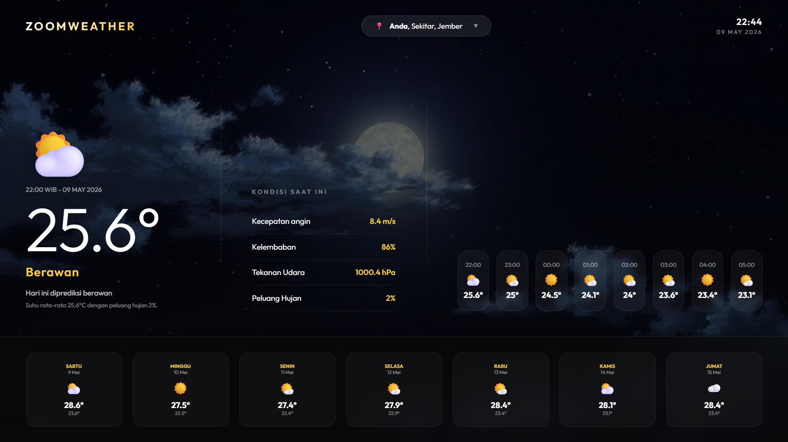

## Ringkasan Proyek

Proyek ini adalah aplikasi web cuaca bernama **ZoomWeather** berbasis PHP native. Aplikasi menampilkan prakiraan cuaca berdasarkan lokasi pengguna, baik dari koordinat browser maupun pilihan wilayah Indonesia sampai level desa.

Arsitektur utama:

- Frontend: HTML, CSS native, JavaScript native, dan PHP partial templates.
- Backend: PHP native dengan class `Controller`, `ApiService`, dan `BackgroundSet`.
- Deployment: disiapkan untuk Vercel melalui `api/index.php` dan `vercel.json`.
- Database: belum menggunakan database aktif. Cache koordinat menggunakan file JSON sementara di `sys_get_temp_dir()`.

Tanggal terakhir update dokumen: **10 Mei 2026**

## Framework dan Teknologi

### Frontend

- HTML5
- CSS native/custom
- JavaScript native
- PHP partial rendering
- Google Fonts: `Outfit`
- Browser Geolocation API
- Responsive design dengan media query CSS

Tidak ditemukan framework frontend seperti React, Vue, Angular, Bootstrap, atau Tailwind CSS.

### Backend

- PHP native / vanilla PHP
- cURL PHP untuk HTTP request eksternal
- JSON file cache untuk koordinat hasil geocoding
- Timezone aplikasi: `Asia/Jakarta`

Tidak ditemukan framework backend seperti Laravel, CodeIgniter, Symfony, atau Slim.

### Deployment

- Vercel PHP entry point:
  - `api/index.php`
  - `vercel.json`
- Entry aplikasi utama:
  - `public/index.php`
  - `index.php`

## API yang Digunakan

### 1. Open-Meteo API

Digunakan oleh backend untuk mengambil data prakiraan cuaca berdasarkan latitude dan longitude.

File terkait:

- `classes/ApiService.php`

Endpoint yang digunakan:

```txt
https://api.open-meteo.com/v1/forecast
```

Data cuaca yang diminta:

- `temperature_2m`
- `relative_humidity_2m`
- `precipitation_probability`
- `weather_code`
- `wind_speed_10m`
- `surface_pressure`
- `forecast_days=7`
- `timezone=Asia/Jakarta`

### 2. OpenStreetMap Nominatim API

Digunakan oleh backend untuk:

- Mengubah nama lokasi menjadi koordinat.
- Mengubah koordinat menjadi nama lokasi.

File terkait:

- `classes/ApiService.php`

Endpoint yang digunakan:

```txt
https://nominatim.openstreetmap.org/search
https://nominatim.openstreetmap.org/reverse
```

### 3. EMSIFA API Wilayah Indonesia

Digunakan oleh frontend untuk mengambil daftar wilayah Indonesia secara bertingkat.

File terkait:

- `public/partials/scripts.php`
- `public/partials/modal.php`

Base URL:

```txt
https://www.emsifa.com/api-wilayah-indonesia/api
```

Endpoint yang digunakan:

```txt
/provinces.json
/regencies/{province_id}.json
/districts/{regency_id}.json
/villages/{district_id}.json
```

### 4. Browser Geolocation API

Digunakan frontend untuk meminta koordinat pengguna saat halaman dibuka tanpa parameter lokasi.

File terkait:

- `public/partials/scripts.php`

Jika izin lokasi diberikan, aplikasi redirect ke:

```txt
?lat={latitude}&lon={longitude}
```

## Fitur Frontend

- [x] Tampilan utama aplikasi cuaca `ZoomWeather`.
- [x] Background gambar dinamis sesuai waktu dan kondisi cuaca.
- [x] Tampilan suhu utama saat ini.
- [x] Tampilan ikon/emoji kondisi cuaca.
- [x] Ringkasan prediksi harian.
- [x] Detail kondisi saat ini:
  - Kecepatan angin
  - Kelembaban
  - Tekanan udara
  - Peluang hujan
- [x] Prakiraan per jam untuk 8 data terdekat.
- [x] Prakiraan mingguan sampai 7 hari.
- [x] Topbar dengan nama aplikasi, lokasi aktif, jam, dan tanggal.
- [x] Jam live yang diperbarui berkala dengan JavaScript.
- [x] Modal pemilihan lokasi.
- [x] Dropdown wilayah bertingkat:
  - Provinsi
  - Kabupaten/Kota
  - Kecamatan
  - Desa
- [x] Validasi pemilihan lokasi sampai tingkat desa.
- [x] Auto geolocation saat tidak ada parameter lokasi.
- [x] Fallback lokasi default ke Mastrip, Sumbersari, Jember, Jawa Timur.
- [x] Responsive layout untuk desktop, tablet, dan mobile.
- [x] Horizontal scroll untuk prakiraan per jam dan mingguan di mobile.

## Fitur Backend

- [x] Controller cuaca sebagai penghubung antara frontend dan service API.
- [x] Ambil cuaca berdasarkan nama wilayah.
- [x] Ambil cuaca berdasarkan koordinat latitude dan longitude.
- [x] Geocoding lokasi dari nama desa, kecamatan, kabupaten, dan provinsi.
- [x] Reverse geocoding dari koordinat menjadi nama lokasi.
- [x] Cache koordinat berbasis file JSON.
- [x] Fallback query geocoding jika pencarian desa lengkap tidak ditemukan.
- [x] Request HTTP eksternal menggunakan cURL.
- [x] Parsing response JSON dari API eksternal.
- [x] Mapping kode cuaca WMO menjadi deskripsi bahasa Indonesia dan emoji.
- [x] Penyusunan data cuaca per jam.
- [x] Penyusunan data ringkasan prediksi harian.
- [x] Penyusunan data detail cuaca untuk tampilan.
- [x] Penyusunan data mingguan dari forecast 7 hari.
- [x] Pemilihan background berdasarkan periode waktu dan kondisi cuaca.
- [x] Membaca konfigurasi background dari `.env` atau environment variable.
- [x] Error handling sederhana jika lokasi atau API gagal.

## Struktur File Penting

```txt
api/index.php
classes/ApiService.php
classes/Controller.php
classes/background-set.php
config/database.php
public/index.php
public/partials/head.php
public/partials/scripts.php
public/partials/modal.php
public/partials/topbar.php
public/partials/current-weather.php
public/partials/details.php
public/partials/hourly.php
public/partials/weekly.php
public/partials/background.php
vercel.json
docs/fullFlows.md
```

## Catatan Analisis

- `config/database.php` saat ini kosong, sehingga belum ada koneksi database aktif.
- `classes/wilayah_cache.json` ada di repository, tetapi implementasi aktif `ApiService` memakai cache di folder temporary server melalui `sys_get_temp_dir()`.
- `docs/fullFlows.md` masih menyebut Weather Ewalabs sebagai rancangan flow, tetapi kode aktif saat ini menggunakan **Open-Meteo API**.
- Method `Controller::getWeather()` memanggil `$this->apiService->getData()`, tetapi method `getData()` tidak ditemukan pada `ApiService`. Jalur aktif aplikasi saat ini memakai `getWeatherByLocation()` dan `getWeatherByCoords()`.
- SSL verification pada cURL saat ini dimatikan dengan `CURLOPT_SSL_VERIFYPEER=false` dan `CURLOPT_SSL_VERIFYHOST=false`.

## Checklist Fitur yang Telah Dibuat

### Core Weather

- [x] Menampilkan cuaca berdasarkan lokasi default.
- [x] Menampilkan cuaca berdasarkan pilihan wilayah.
- [x] Menampilkan cuaca berdasarkan koordinat pengguna.
- [x] Menampilkan forecast 7 hari.
- [x] Menampilkan forecast per jam.
- [x] Menampilkan detail parameter cuaca.

### Location System

- [x] Integrasi API wilayah Indonesia EMSIFA.
- [x] Pemilihan lokasi bertingkat.
- [x] Geocoding lokasi ke koordinat.
- [x] Reverse geocoding koordinat ke nama lokasi.
- [x] Cache koordinat untuk mengurangi request geocoding berulang.
- [x] Fallback lokasi default.

### UI/UX

- [x] Layout utama cuaca.
- [x] Modal pemilihan lokasi.
- [x] Background dinamis.
- [x] Animasi ringan pada ikon cuaca dan kartu forecast.
- [x] Desain responsive mobile.
- [x] Jam live pada topbar.

### Deployment

- [x] Entry point untuk Vercel.
- [x] Konfigurasi `vercel.json`.
- [x] Environment variable untuk background.

## Checklist Potensi Pengembangan

- [ ] Mengaktifkan database nyata untuk cache wilayah/koordinat.
- [ ] Menambahkan endpoint API internal khusus JSON.
- [ ] Menambahkan test otomatis.
- [ ] Mengaktifkan SSL verification cURL untuk produksi.
- [ ] Merapikan method backend yang tidak terpakai atau belum tersedia.
- [ ] Sinkronisasi `docs/fullFlows.md` agar sesuai dengan Open-Meteo.
- [ ] Menambahkan loading state pada dropdown wilayah.
- [ ] Menambahkan pesan error yang lebih ramah pada UI.
